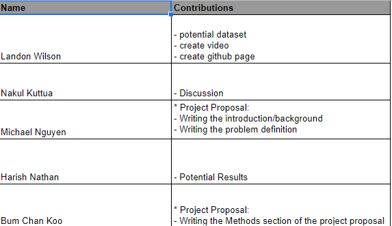

# cs4641-project
### Contributors: Landon Wilson, Michael Nguyen, Nakul Kuttua, Harish Nathan, Bum Chan Koo

### Presentation Link:
[Project Proposal Presentation](https://youtu.be/ZLswRu-54Zo)

## Introduction:
The subject of the project is the detection of fake news using machine learning,
in essence a classification problem. The literature in this field has found general
success with supervised learning, particularly decision trees and neural networks,
for determining the credibility of an article [1]. Unsupervised learning lacks
as much literature as its counterpart, but graph-based approaches have been
successful among those that do take such approach [2].

There are multiple data sets we are working but at minimum the data sets contain
an article's headline, its text, the author's name, and a label of whether or not it
is legitimate. That gives at minimum three features, which will most likely be
increased after processing the text of each article as it holds the bulk of a
sample's data.

---
## Problem Definition:

Humans on average are not great at determining the authenticity of an article
with 62% accuracy rate in one case [3]. However, on the same data, ML models were able
to identify the legitimacy of an article with 83% accuracy [3]. The importance
of factual news is ever growing, especially in an age where any information is easily
disseminated, so to improve the detection of misinformation would be a great
boon.

---
## Timeline:

## Contributions:

## Datasets:
[Dataset 1](https://data.4tu.nl/articles/dataset/Repository_of_fake_news_detection_datasets/14151755)

[Dataset 2](https://www.kaggle.com/datasets/mohit28rawat/fake-news)

## Methods:
### Libraries:
We will use Scipy, Numpy, Pandas, and scikit-learn libraries to implement
our ML Algorithms.

Matplotlib for visualizing data.

Plotly for interactive visuals.

### ML Algorithms:
For our first model, we'll implement K-Means Clustering to analyze similarity 
of news headlines via clustering.

Our second model will implement logistic regression, a supervised learning method that will determine
probability of a news article being 'fake' or 'real'. 

Lastly, we will implement another supervised learning model for our final model (TBD).

### Evaluation:
We will use the sklearn.metric for evaluation metrics. 

Clustering models will use normalized mutual information scores and Silhouette Coefficient to evaluate clusters.

Regression models are evaluated using mean squared error. 

Classification models will use precision and accuracy measurements. 

---
## Results:
We will measure our potential results by using the scikit-learn library. Specifically, we will use the metric functions API to evaluate our potential results. The classification metric would be the metric function to be used for our first model. For our second model, we would use the regression metric. And finally, for the last model, we would use the metric function that best fits which supervised learning model we choose.

---
## Discussion:
Of our potential results, we hope it helps us to better understand how to differentiate between legitimate headline articles and fake news articles.  It should also be able to tell us what areas we need to improve in, as well as which algorithms were most efficient. From this, we should be able to determine how to further improve the project, and if we should look to other libraries and methods for our models, in order to further simplicity and efficiency.

---
## References:
1. Hakak, S., Alazab, M., Khan, S., Gadekallu, T. R., Maddikunta, P. K., &amp; Khan, W. Z. (2021). An ensemble machine learning approach through effective feature extraction to classify fake news. Future Generation Computer Systems, 117, 47–58. [https://doi.org/10.1016/j.future.2020.11.022](https://doi.org/10.1016/j.future.2020.11.022)
2. Gangireddy, S. C., P, D., Long, C., &amp; Chakraborty, T. (2020). Unsupervised fake news detection. Proceedings of the 31st ACM Conference on Hypertext and Social Media. [https://doi.org/10.1145/3372923.3404783](https://doi.org/10.1145/3372923.3404783)
3. Spezzano, F., Shrestha, A., Fails, J. A., &amp; Stone, B. W. (2021). That's fake news! Investigating the Reliability of News When Provided Title, Image, Source Bias and Full articles. Proceedings of the ACM on Human-Computer Interaction, 6(CSCW1), 1–19. [https://doi.org/10.1145/3449183](https://doi.org/10.1145/3449183)

---

