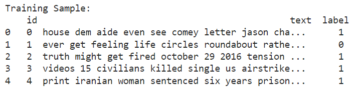

# cs4641-project
### Contributors: Landon Wilson, Michael Nguyen, Nakul Kuttua, Harish Nathan, Bum Chan Koo

## Introduction:
The subject of the project is the detection of fake news using machine learning,
in essence a classification problem. The literature in this field has found general
success with supervised learning, particularly decision trees and neural networks,
for determining the credibility of an article [1]. Unsupervised learning lacks
as much literature as its counterpart, but graph-based approaches have been
successful among those that do take such approach [2].

There are multiple data sets we are working but at minimum the data sets contain
an article's headline, its text, the author's name, and a label of whether or not it
is legitimate. That gives at minimum three features, which will most likely be
increased after processing the text of each article as it holds the bulk of a
sample's data.

---
## Problem Definition:

Humans on average are not great at determining the authenticity of an article
with 62% accuracy rate in one case [3]. However, on the same data, ML models were able
to identify the legitimacy of an article with 83% accuracy [3]. The importance
of factual news is ever growing, especially in an age where any information is easily
disseminated, so to improve the detection of misinformation would be a great
boon.

---
## Dataset:

[Dataset](https://www.kaggle.com/datasets/mohit28rawat/fake-news)

This Kaggle data set from 4 years ago consists of 5 columns: a unique id, the title of the article, the author of the article, the text of the article, and a boolean value to represent if it is fake news or not. It consists of 25,514 entries total. Following the 80-20 rule, we have 20,387 entries for training and 5,127 entries for validation.
Because we found this dataset on Kaggle, the data was clean for the most part, but there were some aspects of the data that needed some processing.

What was done to the data was to make it more consistent in order to make it ready for machine learning work. Namely, we removed all articles that did not contain a certain amount of ASCII characters in order to filter out non-English articles.
Then, we removed stop words (the, a, an, etc.) within the text as well as lower casing the entirety of the body text. The latter was done to make text consistent and the former done to remove unnecessary words that have little meaning and appear frequently in all articles. Finally the text was tokenized into a list of strings deliminated by spaces to make processing it easy. This meant that punctuation was removed but since we are not concerned about the discerning the meaning of the text, it was fine in our case.

Additionally, both models processed the dataset to utilize the text's tf–idf information using the tfidfvectorizer library. This library analyzes a corpus, in our case the dataset, and return its tf–idf information. The tf–idf stands for term frequency–inverse document frequency, so it provides the term-frequency (tf) of words and its inverse document frequency.

Term-frequency is easy to reason about, it is just how often the term appears in a document of the corpus. However, inverse document frequency (idf) measures how common that term appears among all documents in the corpus. Therefore a unique word like a reporter's name would have a low tf but high idf, but a common word like "Mr." would have a high tf and low idf. Therefore, idf data is vital to finding words (features) that were somewhat unique to each sample.

When we prepared the data for training the decision tree model, we removed the unnecessary columns such as the author and title columns. A sample of the resulting data is seen below.

---

## Methods:
### Libraries:
We will use sklearn, numpy, pandas libraries to implement our ML Algorithms.

Matplotlib and Seaborn for visualizing data.

### ML Algorithms:
For our first model, we'll implement K-Means Clustering to analyze similarity 
of news headlines via clustering.

Our first supervised model will implement a decision tree classifier. 

Lastly, we will implement a neural network.

---

## Results and Discussion:

### K-Means Initial Setup:
For our first model, we decided to implement the K-Means unsupervised model.

First, we started by taking our cleaned up dataset and setting up our bag-of-words.
We did this by exporting our dataframe as a csv file and utilizing pandas to import our data as a pandas dataframe. 
From there we simply isolated the text column of our dataset as a regular python list and inputted it into a scikit-learn tfidVectorizer which helped form our bag-of-words which will serve as our 'x'.
The tfidfvectorizer made our bag of words contain meaningful data to the text of each article namely the previously mentioned tf and idf.
We then take the corresponding labels from the label column of our dataset which will serve as our 'y actual'.

Next, we needed to reduce the number of features using PCA.
We initialized our scikit-learn PCA instance with two components and performed fit and transform on our 'x' values in order to reduce it to just two features which we call as 'x_dr'.

Finally, we began implementing our K-Means model.
As soon as we started to work on implementing K-Means, we immediately ran into an issue.
Because this problem is, in essence, a binary classification problem by nature and thus is better suited for supervised models, it did not lend itself handely to an unsupervised model such as K-Means.
However, in order to address this issue, we simply set the number of clusters in our K-Means model to K=2 (But it is not difficult to see why this may cause issues down the line as this approach does not take into account how the number of clusters affect distortion which is typically addressed using elbow method). 

After we implemented K-Means we ran the task of prediction on our 'x_dr' values in order to get our 'y predicted'

### K-Means Results:
The K-Means model return a Silhouette Score and a Normalized Mutual Information Score of 0.555 and 0.001 respectively.

The graph below takes 'x_dr' and graphs d1 on the x axis and d2 on the y axis. The data points of our our graph labeled 'Predicted' are color coded using 'y predicted' whereas the graph labeled 'Actual' is color coded using 'y actual'.

### K-Means Results and Analysis:
The poor results are not unexpected.
Because the problem statement demands that we classify each of the online articles as either true or false, the most logical choice for k in our K-Means model would be two; however, there is a problem with this approach.
While assigning two clusters would be the most logical choice for a binary classification problem, the assignment of which cluster is designated as false or true will be largely arbitrary in the context of a clustering algorithm such as K-Means, as the labeling of our data points would be entirely dependent on the two randomized points chosen to be our cluster centers; regardless of the actual contents contained in our online articles.

Because of this we believe K-Means is ill fitted for the task of classifying online articles as either true or false and thus have decided to move on to Supervised learning models.

### Decision Tree Initial Setup:
For our decision tree model, we had to turn our long articles into simpler data for our model to understand. To do this, we used the tfidfvectorizer library. So, in our case this allowed us to convert our lengthy articles into a "bag of words" for our model to run. We passed the enitre set of words alongside their tf-idf data for classification. The idea with this approach is that the decision tree will reason out the relationships of words, like term frequency, and correlate it with the article's validity. We found the most frequent words in real and fake articles, but used that solely for the visualizations, seen below in frequency charts. Furthermore, we have shown the dictionary mappings of the top 5 which we used to determine the most important words for our tree. 

### Decision Tree Results and Analysis:
For our decision tree, we evaluated the accuracies and precisions of the testing data and training data. We ran into overfitting issues with the 
training data getting a 100.00% accuracy and precision values, so we decided to prune our tree. We tested various depths, checking the accuracies until our training accuracy was reasonable. As seen by the chart below, without pruning our tree, the training set is 100% accurate, but our validation set flattens out much sooner. We decided that a depth of 7 was the best depth for our purposes. 

Using sklearn.metrics, we were able to determine the accuracy and precision of our model, shown below. Our results show that our tree with tuned parameters has very high precision and accuracy, especially for a decision tree. The training and testing data are very similar, although the training is higher which indicates that the model may be slightly overfitting still, although decreasing the maximum depth of the tree hurts our models accuracy. Overall, the decision tree model seems to be a promising approach for classifying articles as real or fake.

To guarantee a holistic model, we wanted to ensure that our positive predictions are complete, meaning that we capture all the true positives. Using sklearn metrics, we calculated our recall of our data which was nearly a perfect recall score. A number close to 1 indicates that our model ensures that most of the true positives are deemed true, which it does.

Overall, these metrics give us a good glimpse at how well our model works. We know our decision tree has a high precision score which tells us that our model is consistent in its findings. Pairing the precision score with the high accuracy score indicates that our model is consistently determining fake news as fake and real news as real. Finally, the recall score of .98 tells us that the true positives are almost always correctly determined to be true by our model, which is important because we want the real news to always be marked as real, as there is less penalty for incorrectly marking fake news as real. Obviously, we could potentially improve these findings by increasing the number of data points; however, finding datasets with more data points proved to be difficult. 

### Neural Network Initial Setup:
Our initial setup for our third model is similar to how our Decision Tree was set up. The tfidfvectorizer library was used to shorten long articles into a manageable "bag of words". This "bag of words" served as our x while our y values were the labels. We decided to train three neural network models using different activation functions (ReLU, Tanh, Sigmoid) to see which would yield the best results. Once we were finished training and fitting the neural network models, we were then able to display several visualizations.

### Neural Network Results and Analysis:
For the neural networks, we were able to display accuracies for all three neural networks. In the beginning, our training accuracies turned out to be 100%. This meant that overfitting was ocurring. We were able to combat the overfitting by tuning the parameters for each model's classifier function. One specific issue we noticed was that we had too many hidden layers. Once we reduced the number of hidden layers, the accuracies started converging properly. Using metrics from sklearn.metrics, we were able to display accuracies for all three neural networks.

When looking at these accuracies, we can see that the neural networks with the ReLU and Tanh functions performed the best overall. The training and testing accuracies are only slightly different, which doesn't pose a major overfitting problem. However, we can see the biggest difference between the sigmoid function and the ReLU/Tanh functions when visualizing the loss over time.

As we can see here, the models using ReLU and Tanh drastically drop loss until around 40 iterations. However, the model using sigmoid continues at a high loss even over 80+ iterations. This can be explained by the sigmoid activation function working well for multi-level classification rather than binary. We continue to see these differences in the heatmaps.

The first heatmap is visualizing the ReLU model, the second heatmap is visualizing the Tanh model, and the last heatmap is visualizing the Sigmoid model. Between the ReLU and Tanh heatmaps, we see a very small difference between the classifications. This checks out with the accuracies and loss visualizations of these two models as seen earlier. However, when we compare the ReLU vs sigmoid heatmaps or the Tanh vs sigmoid heatmaps, we can see larger differences. These differences mainly occur when the article is a fake article. We can see that it classifies more of the fake articles as real compared to ReLU or Tanh. This would likely be a result of the problem I mentioned earlier, that sigmoid works better for multi-level classification rather than binary.

These metrics and visualizations give us a good understanding of how accurate these three models are. Even though the sigmoid model performs worse than ReLU and Tanh, it still performs significantly better than unsupervised models such as K-means. All three models, specifically ReLU and Tanh were very accurate in classifying these news as real or fake. The model using sigmoid had a little more trouble classifying fake news as fake compared to the other two models, but it still had a testing accuracy of over 91%. Overall, neural networks are a great choice for binary classification, which is perfect for our problem at hand.

---
## Conclusion:
From what we performed and with the data we obtained, it is very clear that the unsupervised model (K-Means) performed distinctly worse to the supervised models (Decision Tree and Neural Networks). The reason being for this is that text classification is a field that doesn’t necessarily mesh well with unsupervised models, but is much more suited for supervised models. And to quickly back this up, we have seen that our Neural Networks model performed better at around a 7% higher difference, and the highest accuracy overall was RELU at 95%.

In conclusion, the models that we chose at the beginning of this project proved what we hypothesized in the beginning, with that supervised models work better for text classification. 

Using this newfound knowledge, we as computer scientists can be much more vigilant in using supervised models and sophisticated machine learning concepts to reduce the spread of misinformation.

---
## Final Video Link:
https://www.youtube.com/watch?v=zzJhwvkg714&ab_channel=NakulKuttua

---
## Timeline:

---
## Contributions:

---
## References:
1. Hakak, S., Alazab, M., Khan, S., Gadekallu, T. R., Maddikunta, P. K., &amp; Khan, W. Z. (2021). An ensemble machine learning approach through effective feature extraction to classify fake news. Future Generation Computer Systems, 117, 47–58. [https://doi.org/10.1016/j.future.2020.11.022](https://doi.org/10.1016/j.future.2020.11.022)
2. Gangireddy, S. C., P, D., Long, C., &amp; Chakraborty, T. (2020). Unsupervised fake news detection. Proceedings of the 31st ACM Conference on Hypertext and Social Media. [https://doi.org/10.1145/3372923.3404783](https://doi.org/10.1145/3372923.3404783)
3. Spezzano, F., Shrestha, A., Fails, J. A., &amp; Stone, B. W. (2021). That's fake news! Investigating the Reliability of News When Provided Title, Image, Source Bias and Full articles. Proceedings of the ACM on Human-Computer Interaction, 6(CSCW1), 1–19. [https://doi.org/10.1145/3449183](https://doi.org/10.1145/3449183)

---
